# Exact Cover
**Note: Try to paraphrase when putting these information into our report, a lot of these information are word-for-word from the original documents.**\
Example: Given matrix of 0s and 1s, does it have a set of rows containing exactly one 1 in each column. The matrix below has rows 1, 4 and 5.
```
[   0 0 1 0 1 1 0
    1 0 0 1 0 0 1
    0 1 1 0 0 1 0
    1 0 0 1 0 0 0
    0 1 0 0 0 0 1
    0 0 0 1 1 0 1   ]
```
### Knuth's Algorithm X
- Is an algorithm for solving the *exact cover* problem.
- Is a recursive, nondeterministic, depth-first, backtracking algorithm to demonstrate the utility of *dancing links*.\
**The Algorithm**:
> If matrix $A$ is empty, the problem is solved; terminate successfully.
> Otherwise choose a column, $c$ (deterministically).
> Choose a row, $r$, such that $A[r,c] = 1$  (nondeterministically).
> Include $r$ in the partial solution.
> For each $j$ such that $A[r,j] = 1$,
> 	delete column $j$ from matrix $A$;
> 	for each $i$ such that $A[i,j] = 1$,
> 		delete row $i$ from matrix $A$.
> Repeat this algorithm recursively on the reduced matrix $A$.
### Dancing Links (DLX)
- Is a technique for adding and deleting a node from a circular doubly linked list.
- Particularly useful for efficiently implementing backtracking algorithms such as *Knuth's Algorithm X*.\
**Remove a node**: Let $L[x]$ and $R[x]$ point to the predecessor and successor of that element.
$$L[R[x]] \leftarrow L[x], \quad R[L[x]] \leftarrow R[x] \qquad \text{(1)}$$
Example:
```java
A <-> B <-> C <-> A

L[R[B]] <- L[B] // L[C] = A
R[L[B]] <- R[B] // R[A] = C
```
**Put node back**:
$$L[R[x]] \leftarrow x, \quad R[L[x]] \leftarrow x\qquad \text{(2)}$$
```java
A <-> C <-> A

L[R[B]] <- B // L[C] = B
R[L[B]] <- B // R[A] = B
```
- The matrix representation Knuth used for DLX is implemented as doubly linked lists: Given a binary matrix, DLX represent the 1s as *data objects*. Each data object $x$ $L[x], R[x], U[x], D[x]$ and $C[x]$. This also happens to form a *torus* (basically a donut).
- $C[x]$ is a link tothe *column object* $y$ - a special data object that has two additional fields $S[y]$ and $N[y]$, representing column size and symbolic name chosen arbitrarily. Column size is the number of data objects that are currently linked together from the column object.
- Each column has a symbolic name from $A$ to $G$ where $h$ is the root column object - a special case column object which uses the same data structure but cannot link to any data objects directly. It is only used as an entry point to the data structure.\
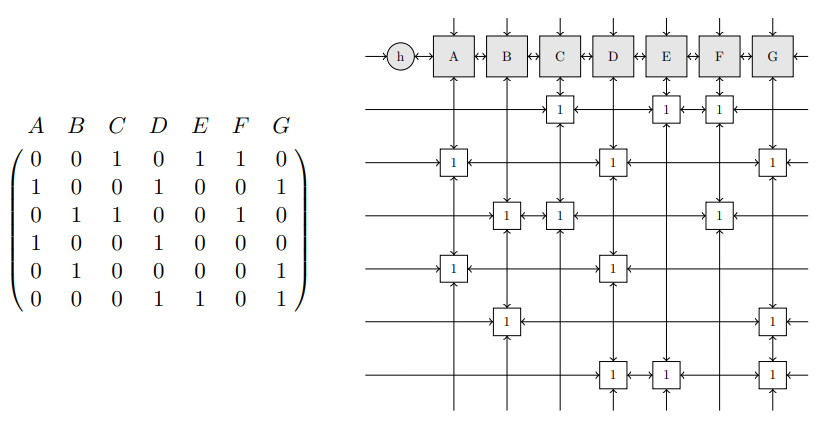
- The nondeterministic algorithm to find all exact covers can now be cast in the following explicit, deterministic form as a recursive function The following is the original `search(k)` function pseudocode in Knuth's paper:\
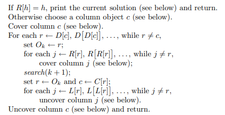
- The following is a more modern and practical adaptation of Knuth's implementation in [KTH's document](https://www.kth.se/social/files/58861771f276547fe1dbf8d1/HLaestanderMHarrysson_dkand14.pdf). While there are differences, both are functionally equivalent in their core logic of Dancing Links and Algorithm X.
	- *h* - root column object
	- *k* - current depth
	- *s* - partial solution with a list of data objects
- The function should be invoked with `k = 0` and `s = []`. On row 6, choosing the column object can be implemented in two different ways: choosing the leftmost uncovered column (the first column object after the root column object), or choosing the column object with the fewest number of 1s occurring in a column. The latter is argued by Knuth to minimize the branching factor. An oversimplified explanation of the function:
	- If the header points to itself (`R[h] = h`), it means all columns are covered (exact cover is solved) and the solution is printed.
	- `choose_column_object(h)` selects the next column to cover by using minimum remaining values heuristic. $r \leftarrow D[c]$ gets the first data object in the column - the first row that covers this column.
	- The main loop begins - while there are rows to explore in the column ($r \neq c$):
		- Add row to partial solution ($s \leftarrow s + [r]$)
		- Cover related columns: For each column that this row covers (traverse right using `R` pointer), `cover(C[j])` removes the column from the matrix.
		- Recursive call to search deeper with the updated matrix: `search(h, k+1, s)`
		- Backtracking: Retrieve the most recently added row from the solution stack and get the column header for this row ($C[r]$ gives the column object this row node belongs to). The `L` pointer traverses left and performs `uncover(C[j])`, which essentially is just the reverse of the covering sequence.
		- After all of that, move to the next row: $r \leftarrow D[r]$ gets the next row in this column.
	- Uncover the initially selected column and return.\
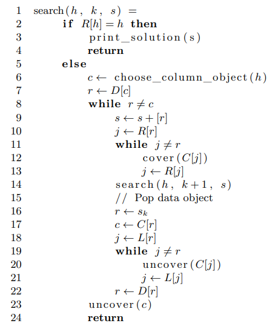
- `cover` and `uncover` will be for a specified column object $c$. `cover` makes uses of operation $(1)$ and removes $c$ from the doubly linked list of column objects and removes all data objects under $c$. `uncover` makes uses of operation $(2)$ and undo operation $(1)$. The rows that were removed from top to bottom must be undone from bottom to top. The same applies for columns that were removed from left to right must be undone from right to left.\
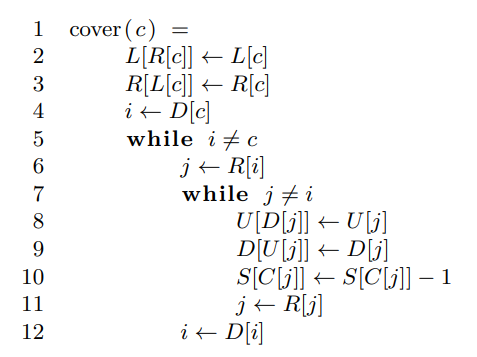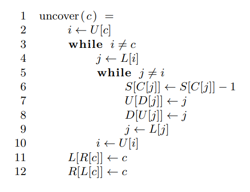
#### Solving Steps Example
The following is a walkthrough of applying DLX to find a solution. This is the same example as in [Knuth's paper](https://arxiv.org/pdf/cs/0011047), but made easier to read by [KTH](https://www.kth.se/social/files/58861771f276547fe1dbf8d1/HLaestanderMHarrysson_dkand14.pdf).
- DLX is invoked with `search(h,0,[])`, $h \neq R[h]$, column $A$ is chosen as the next column object to be covered.
- The first two rows 2 and 4 in $A$ will be removed, this affects data objects in $D$ and $G$ since these two column objects also have data objects on row 2 and 4. A key point to note is that conceptually (such as in the second image) it can be understood that both rows are eliminated in both branches due to covering $A$, but in reality only the selected row gets removed first, and the remaining follow suit.
- The dotted line shows how the new links are formed.
- With $r$ pointing to the first data object in $A$, the next columns to be covered are either $D$ and $G$ (row 2) or just $D$ (row 4).\
\
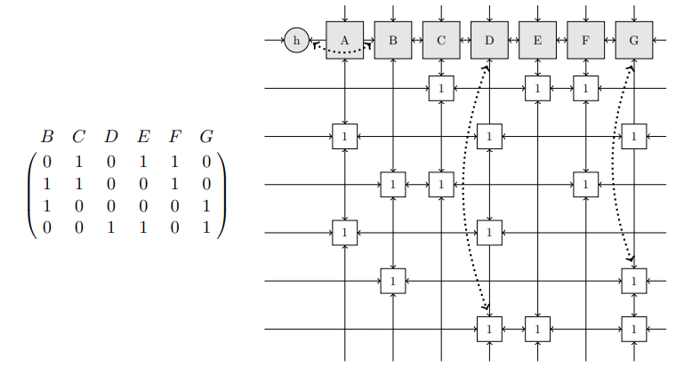\
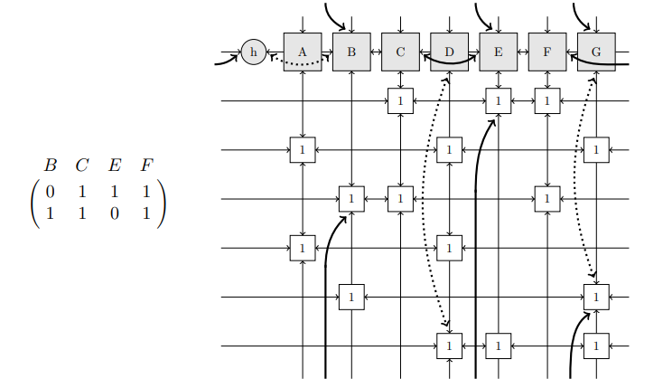\
```
    A  B  C  D  E  F  G
1: [0, 0, 1, 0, 1, 1, 0]  
2: [1, 0, 0, 1, 0, 0, 1]
3: [0, 1, 1, 0, 0, 1, 0]  
4: [1, 0, 0, 1, 0, 0, 0]  
5: [0, 1, 0, 0, 0, 0, 1]  
6: [0, 0, 0, 1, 1, 0, 1]
```
- First branch (remove row 2):
	- Row 2 covers $A$, $D$, $G$. This also removes row 4 ($A = 1$, $D = 1$), row 5 ($G = 1$) and row 6 ($D = 1$, $G = 1$).
	- `search(h,1,s)`: The remaining columns to cover are $B$, $C$, $E$, $F$ with remaining rows 1, 3. Column $B$ is covered next which has the fewest remaining 1s. This also covers $C$ and $F$.
	- `search(h,2,s)`: Only $E$ remains with row 1. However, row 1 also covers $C$ and $F$ which are already removed, creating a conflict. This branch fails and the algorithm backtracks.
```
Row 2 branch at search(h,1,s)
    B  C  E  F
1: [0, 1, 1, 1]  
3: [1, 1, 0, 1]  

Row 2 branch at search(h,2,s)
    E
1: [1]
```
- Second branch (remove row 4):
	- Row 4 covers $A$, $D$ This also removes row 2 ($A = 1$, $D = 1$) and row 6 ($D = 1$).
	- `search(h,1,s)`: The remaining columns to cover are $B$, $C$, $E$, $F$, $G$ with remaining rows 1, 3, 5. Column $E$ is covered next which has the fewest 1s. This also covers $C$ and $F$.
	- `search(h,2,s)`: Only $B$ and $G$ remains with row 5. These are the only two columns that occupy row 5, so there are no conflicts and all columns are covered.
```
Row 4 branch at search(h,1,s)
    B  C  E  F  G
1: [0, 1, 1, 1, 0]  
3: [1, 1, 0, 1, 0]
5: [1, 0, 0, 0, 1]

Row 4 branch at search(h,2,s)
    B  G
5: [1, 1]
```
 The solution for this problem can be printed as follows, where `A D` is for row 4, `E F C` for row 1 and `B G` for row 5.
```
A D
E F C
B G
```
#### Differences to Algorithm X
On paper, DLX *is* Algorithm X but implemented with a clever data structure for exponentially faster optimization.

| Feature        | Algorithm X                                  | DLX                                                               |
| -------------- | -------------------------------------------- | ----------------------------------------------------------------- |
| Representation | 2D matrix (dense/sparse)                     | Doubly linked toroidal structure                                  |
| Cover/Uncover  | Matrix operations (slow)                     | Pointer updates (O(1) time)                                       |
| Backtracking   | Requires recursive matrix copies/restoration | Pointer manipulation by re-linking pointers (no data duplication) |
| Efficiency     | Poor (exponential time)                      | Highly optimized                                                  |
| Implementation | Conceptual through pseudocode                | Concrete with Knuth's implementation                              |
### Reducing Sudoku
- An algorithm for reducing a grid to an exact cover problem is required, otherwise DLX cannot be used.
- The rules of Sudoku can be described as a constraint:
	- **Cell** - position constraint.
	- **Row** - row constraint.
	- **Column** - column constraint.
	- **Box** - region constraint.
- Consider a grid $G$ with at least 17 clues and one unique solution (this is the least clues to still guarantee a solution currently known), the reduction of $G$ must preserve the constraints in a binary matrix $M$. Have each row in $M$ describe all four constraints for each cell in $G$. When a row is chosen from $M$ as part of the solution, what is actually chosen is an integer which complies with all four constraint for the cell in $G$ that the row describes. Each cell in $G$ creates rows as follows, and constraints can come in any order as long as they are consistent for all rows. The total number of columns required in $M$ is $81 \cdot 4 = 324$ A visual representation of how each constraint works can be found [here](https://www.stolaf.edu/people/hansonr/sudoku/exactcovermatrix.htm) (this uses 1-9 rather than binary for easier reading).\
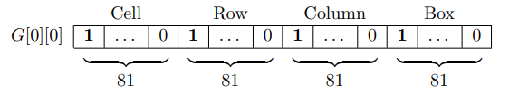
#### Cell Constraint
Each cell in $G$ has 9 candidates which means there must be *9 rows* in $M$ for each cell. One of these 9 rows must be included for the solution for each cell which must cover all columns, therefore each of the 9 rows must have 1s in their own column. This forces the algorithm to always include at least one of the rows for each cell to cover all columns. Since there are 81 cells, there are *81 columns* required. Each cell requires 9 rows, $M$ must have space for its $9 \cdot 81 = 729$ rows.\
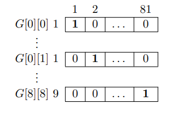
#### Row Constraint
Each row in $G$ can only have a set of integers between 1 and 9. For 9 cells to comply with a row constraint, place the 1s for *one* row in $G$ over *9 rows* in $M$. For one cell in $G$ the 1s are placed in a new column for each of the 9 rows in $M$. Repeat in the same columns for the first 9 cells in $G$ or the 81 first rows in $M$. The next row constraint starts in the 10th cell or on row 82, but the 1s are placed starting after the last column used by the first row in $M$. This forces the algorithm to only pick a unique integer value for each cell in the row.\
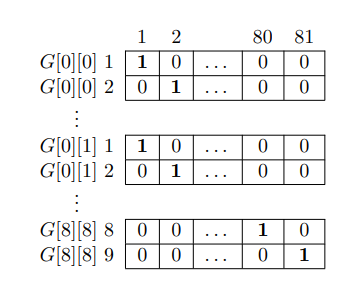
#### Column Constraint
Columns in $G$ can only have a set of integers between 1 and 9. For every cell in $G$ the 1s are placed in a *new column* for each of the *9 rows* in $M$. This is repeated for the second cell and the 1s are starting where the previous cell ended. This maintains for the first 9 cells, and the pattern starts at the first column again for the upcoming 9 cells. This forces the algorithm to only pick a unique integer value for each cell in the column of $G$.\
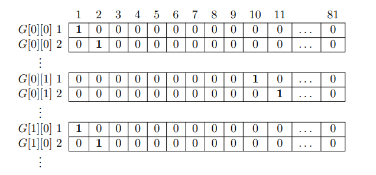
#### Box Constraint
The first 3 cells in $G$ will share the same columns of 1s in $M$. The next 3 cells in $G$ will share the same columns of 1s, and the last upcoming 3 cells for that row will also share the same columns of 1s. The same pattern is repeated for all rows in $G$. Their columns are equal in $M$ if they are in the same box in $G$.\
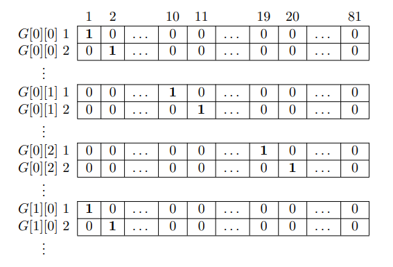
#### Optimization
- It is known that $M$ must be of size 729x324 to store all possible constraints. However, the majority of elements in $M$ are 0s and we are only interested in how the 1s are placed. 
- Therefore, instead of creating the binary matrix M, the links are created directly. The number of columns is always the same and since all columns are needed, the 324 column objects are created and stored in an array. The column objects are still linked together, but the access time to all column objects are now O(1).
- For each new cell in $G$, create four data objects and link them together. Every new cell would be a row further down in $M$, so the four created data objects can instead be appended to the column objects. All insertion operation takes O(1) because it is just a matter of changing the pointers, and all column objects can be accessed in O(1) through the array. This means that every new cell takes O(1) to insert as links.
- This is not a reduction to an exact cover problem but rather a reduction directly to DLX.
